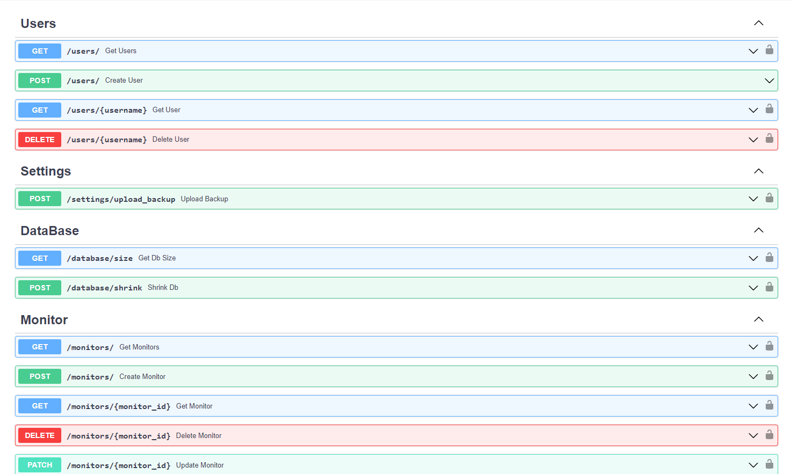

# Uptime-Kuma-Web-API

## A REST API wrapper for [Uptime Kuma](https://github.com/louislam/uptime-kuma) using [Uptime-Kuma-API](https://github.com/lucasheld/uptime-kuma-api)

---

## EndPoints:




## How to use it:

---

### Environment Variables :

#### Required
You have to define these ENV VARS in order to connect to your KUMA server.

    KUMA_SERVER: The URL of your Uptime Kuma instance. ex: https://uptime.example.com
    KUMA_USERNAME: The username of your Uptime Kuma user
    KUMA_PASSWORD: The password of your Uptime Kuma user
    ADMIN_PASSWORD: An admin password to access the API

#### Optional
Additional configuration variables available

    ACCESS_TOKEN_EXPIRATION: Minutes the access token should be valid. Defaults to 8 days.
    SECRET_KEY: A secret value to encode JWTs with

#### Note:

You have to define your ADMIN_PASSWORD or you wont be able to connect to your rest api.

You will connect with those credentials:

    username = admin
    password = <ADMIN_PASSWORD>

### Features:

- Multi user Kuma api ( without privilege YET!!) with a small SQLite db
- Easy to use REST API with most of the Uptime-Kuma features
- Swagger Docs
- Dockerized [UptimeKuma_RestAPI Image](https://hub.docker.com/repository/docker/medaziz11/uptimekuma_restapi)
- Multi-architecture support (amd64, arm64)

### Example :

You can simply create a docker compose file like this :

```yaml
version: "3.9"
services:
  kuma:
    container_name: uptime-kuma
    image: louislam/uptime-kuma:latest
    ports:
      - "3001:3001"
    restart: always
    volumes:
      - uptime-kuma:/app/data

  api:
    container_name: backend
    image: medaziz11/uptimekuma_restapi
    volumes:
      - api:/db
    restart: always
    environment:
      - KUMA_SERVER=http://kuma:3001
      - KUMA_USERNAME=test
      - KUMA_PASSWORD=123test.
      - ADMIN_PASSWORD=admin
    depends_on:
      - kuma
    ports:
      - "8000:8000"

volumes:
  uptime-kuma:
  api:
```

### In order for the example to work: You have to run kuma first then create your kuma username and password then re-run the compose file.

### Example CURL Script:

---

```bash

    TOKEN=$(curl -X -L 'POST' -H 'Content-Type: application/x-www-form-urlencoded' --data 'username=admin&password=admin' http://127.0.0.1:8000/login/access-token/ | jq -r ".access_token")

    curl -L -H 'Accept: application/json' -H "Authorization: Bearer ${TOKEN}" http://127.0.0.1:8000/monitors/

```
